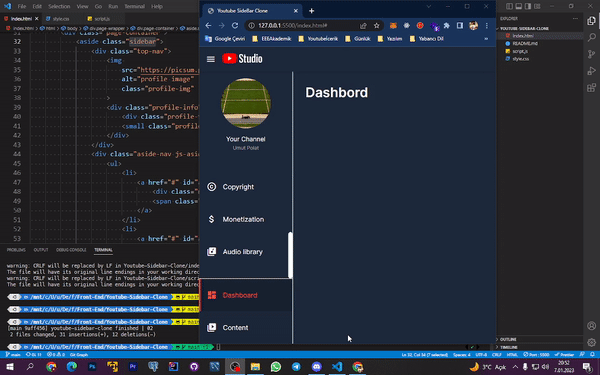

# Youtube Sidebar Project
Project <a href="https://youtube-sidebar-clone.netlify.app/">link<a>

## Gains
- DOM manipulations techniques
- Improved frontend skills
- Using serverless Platforms

## Features

- Supports creating frontend projects using React or Vue
- Supports creating backend projects using Express.
- Allows you to select popular packages to install for each framework
- Prints helpful messages about each framework after project creation

## Contributing

If you want to contribute to the Project Wizard, please fork this repository and create a pull request with your changes.